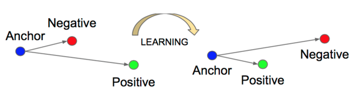

# Softmax vs Triplet loss: Fashion-MNIST

Code for [my blog post about the triplet loss](https://d3rezz.github.io/2019/07/11/triplet-loss.html). I will be using the Fashion-MNIST dataset for training testing my models, which contains images of 10 different items of clothing.

*"The triplet loss works by learning more robust feature representation of the data, where examples of the same class are close together on the feature space and examples belonging to different classes are further apart. It can be used for developing models for face identification, person re-identification, one-shot learning or recommender systems."*

<div align="center">
	
</div>


The code for this post is implemented using Tensorflow 1.13.

# Installation
Start by cloning this repository. Then download the Fashion-MNIST dataset from https://github.com/zalandoresearch/fashion-mnist and copy the contents of its data/ folder into this repository data folder

The folder structure should be:

```
model.py
train.py
utils.py
triplet_loss.py
visualize.py
recommender.py
query_distances.py
fashion_mnist_dataset.py
experiments/
data/
    mnist_reader.py
    split_data.py
    fashion/
        t10k-images-idx3-ubyte.gz
        t10k-labels-idx1-ubyte.gz
        train-images-idx3-ubyte.gz
        train-labels-idx1-ubyte.gz
    test/
    train/
    val/
```

Now split the dataset into train/val/test by running the follwing command from inside the data folder:
```
$ python split_data.py
```

# Running the code
For training the models use:

```
$ python train.py --experiment_dir=experiments/experiment_name/
```

For visualizing the learned embeddings with Tensorboard, create a ProjectorConfig with:
```
$ python visualize.py --experiment_dir=experiments/experiment_name/
```


<div align="center">
	
</div>
